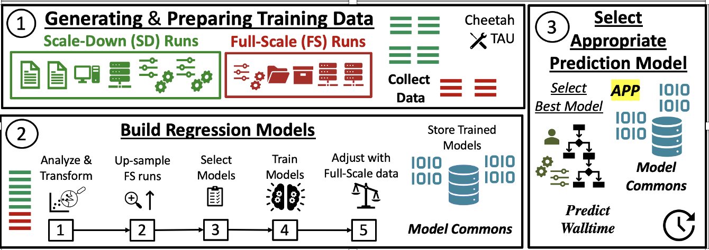
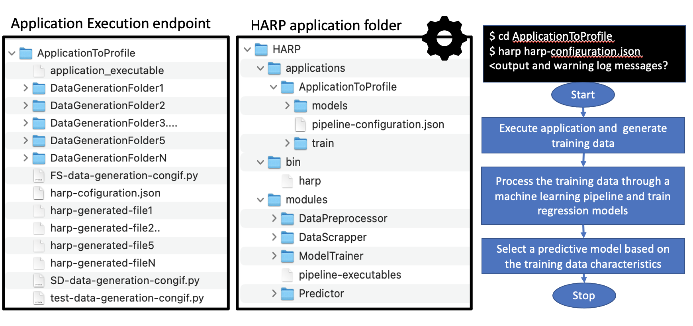

[](https://opensource.org/licenses/BSD-3-Clause)

# HARP - HPC Application Runtime Predictor

## Overview

Researchers use high-performance computing (HPC) cyberinfrastructures (CI) like the Ohio Supercomputer (OSC) or Texas Advanced Computing Center (TACC) to execute computationally intensive diverse scientific workflows. Some workflows are heavy on IO, like genome sequencing (cleaning and assembly), while others, like training DNNs, could be compute (and memory) intensive. Each workflow has a unique resource requirement, and it is essential to profile and understand these needs to allocate shared resources for optimal utilization of the cyberinfrastructure. These resources are expensive, and several jobs compete to get these allocations, sometimes with reasonable wait times (while requesting enormous resources for a long time). Estimating the expected resources for optimally utilizing the compute and memory is challenging, especially considering the need for sufficient history to enable these predictions tailored for unique workflows and execution environments. We explored and established a framework (as shown in Figure 1) that pipelines the solutions to address these challenges. The Framework is configured to generate a history of executions and train suitable regression models to estimate the approximate execution time for a targeted application.


<!-- 


 -->
 
<!--   -->

          Figure 1: The Proposed Framework: training data generation, building regression models, selecting the best model based on custom criteria
  
  
### Components and Characteristics of the Framework (from Figure 1):
1. **Generating and Preparing Training Data:** This module automatically and systematically generates comprehensive, diverse "scaled-down(SD)" and limited, selective "full-scale(FS)" runs with minimal human intervention. We use Cheetah (https://github.com/CODARcode/cheetah) to execute the target application with the pre-defined data generation configurations (SD and FS) to generate the history-of-runs training data.
2. **Building Regression Models:** This module standardizes and prepares the data, trains the selected off-the-shelf regression models with the appropriate hyper-parameters, and stores them for inference. In this phase, the data generated in the first phase is processed to train regression models. Redundant features are eliminated, outliers are removed, and features are transformed to reduce the dimensionality before training the regression models. 
3. **Selecting Appropriate Prediction Model:** This module selects the most appropriate regression model from a pool of trained models from phase 2 with respect to a given policy and target application
Note: The Framework is built on TensorFlow Framework.
  
<!--   -->
 

              Figure 2: Shows the target-application execution endpoint and the harp application folder structure. 

 
## WAYS to configure HARP to setup applications for profiling:
1. Configure HARP with TAPIS to execute HARP and applications to profile as container images. 
2. Install HARP as a loadable module on OSC or localbox.

## WAY 1. Configure HARP with TAPIS to configure HARP and applications to profile as container images. 


**NOTE: IMPORTANT INFORMATION - PLEASE READ**
```
1. TAPIS executes only containerized applications, so HARP (HARP framework) and the Application should be containerized.  
2. Profiling an application HARP Framework with TAPIS is tested on both TACC and OSC systems.
3. Colab Notebooks server as examples for running HARP profiling for a sample Euler application using TAPIS. Make a COPY of the colab or download the Notebooks to execute them. 
4. HARP Framework and example containers could be executed on local box user docker or apptaner servers without TAPIS integration. 
```

Follow through the Colab notebooks for profiling the HARP Container application using TAPIS:
1. For TACC stampede2 example use: https://drive.google.com/file/d/1JyAHUxxZ3pKMXGs28UXMQJn5QZmti1yS/view?usp=sharing
2. For OSC pitzer example use:https://drive.google.com/file/d/1w8qCTWiOjvn8CCx6FqvZzG8ZJBRKy4M3/view?usp=sharing
Alternatively, download the example notebook from the "Notebooks" folder
  
**Steps:**

- 1.Create a new HARP Image [or] using the pre-made HARP Image
- 2.Create an image for the application to be profiled using HARP Framework (Image)
- 3.Refer to Section "_Using HARP to profile an application and predict the execution time_" for steps to execute the container in localbox or a CI (like OSC or TACC nodes) with or without TAPIS.
  

1. **Create a HARP Image using Docker Environment**

a. Use the 'Dockerfile_HARP_local' file to create an Image for executing the Framework on a local box using 'docker build'. 
```
docker build -f DockerFiles/Dockerfile_HARP_local -t harp-framework-local:2.0.0 .

```
b. Use the Dockerfile_HARP_CI file to create an Image for executing the Framework on CI (like TACC or OSC) using 'docker build'. 

```
docker build -f DockerFiles/Dockerfile_HARP_CI -t harp-framework-ci:2.0.0 .
```

c. Push the Image to the docker hub or upload it to any web-accessible location. 

Push the image to a web-accessible location like dockerhub using the following command:
```
docker push <DockerHub>/harp-framework-[local|ci]:2.0.0
```

If you already have access to the pre-compiled images, use these copies of the HARP image from our repository 
a. Use the harp-framework-local:2.0.0  file for executing the Framework on a local box. 
b. Use the harp-framework-ci:2.0.0  file for executing the Framework on TACC or OSC Systems. 

**Note**: Execute the 'docker build' command from the main folder 'harp'.

2. **Create an image for the application to be profiled using HARP Framework (Image)**

Using the Image created in "Step 1" or the respective Image from the ICICLE repository, create an Image for the application to be profiled using the HARP Framework. We refer to the application to be profiled as a 'target application'. <br />

Steps for creating a DockeFile for the target application and building an image using the 'Dockerfile_App_Template' template. <br />

a. Edit the 'ProfileApplication.sh' entry point file to execute the HARP with the pipeline configurations JSON. Replace "pipeline_config.json" with your desired pipeline configuration file in the application work folder.
```
harp pipeline_config.json
```

b. Create a DockerFile for the target application from the following template
```
FROM <web-accessible-path-to-image-hub>/harp-framework-[local|ci]:2.0.0

# 1. Add application required installations.
# none for Euler example

# 2. Target application setup 
# Set the APP_PATH to the location with your application work folder (target application to be profiled) and APP_NAME to the work folder name
ENV APP_PATH="<path-to-target-application>/<target-application-work-folder>"
ENV APP_NAME="<target-application-work-folder>"

# Add the target application work folder to the Image
ADD $APP_PATH /app/$APP_PATH

# 3. Copy the execution endpoint file and set it
COPY DockerFiles/ProfileApplication.sh /app/ProfileApplication.sh

ENTRYPOINT ["sh", "/app/ProfileApplication.sh"]
```

c. Build the application Image (these commands show building an image for an example application 'Euler Number')
a. Use the 'Dockerfile_App_EulerNumber' file to create an Image for executing the Framework on a local box using 'docker build'. 
```
docker build -f DockerFiles/Dockerfile_App_EulerNumber -t harp-app-eulernumber-[local|ci]:2.0.0 .
```
b. Push the Image to the docker hub or upload it to any web-accessible location. 

Push the image to a web-accessible location like dockerhub using the following command:
```
docker push <DockerHub>/harp-app-eulernumber-[local|ci]:2.0.0 
```

Use an existing copy of the Euler Number application image from our repository. 

3. **Refer to Section "_Using HARP to profile an application and predict the execution time_" for steps to execute the container in localbox or a CI (like OSC or TACC nodes) with or without TAPIS.**

## WAY 2. Installation-based HARP setup
* Dependency: Linux, Python 3.9+, git, pip, mpich, psutil, jq(command line JSON parser https://stedolan.github.io/jq/)
* On supercomputers (OSC), it should be installed at a location accessible from the parallel file system
### **Follow these steps to set up HARP as a loadable software module on the Ohio Supercomputer (OSC):**
  ```bash
  git clone https://github.com/ICICLE-ai/harp.git
  cd harp
  chmod 755 install-osc-harp.sh
  ./install-osc-harp.sh
  ```
  If the installation fails, please re-run the script 'install-osc-harp.sh' after deleting the environment 'harp-env' and running the cleanup.sh in the install directory. 
  ```bash
  conda remove --name harp-env --all
  ./cleanup.sh
  ```
This setup installs miniconda, CODAR Cheetah (https://github.com/CODARcode/cheetah), TensorFlow, psutil, pandas, and scikit-learn and configures the Harp framework. Please follow the installation prompts to go ahead with the setup. This installation takes 30-40 mins to finish the setup on Owens login node.
#### Loading the HARP module on OSC
   ```bash
  module use $HOME/osc_apps/lmodfiles
  module load harp 
  export CONDA_HOME=<path_to_miniconda>/miniconda3
  source $CONDA_HOME/bin/activate
  source activate harp_env
   ```
**NOTE**

Things to consider while installing the Framework on OSC
1. [OSC Installation] The installer creates a conda environment, "harp_env" on OSC and uses this environment to execute the Framework. The environment name is used in a couple of Cheetash configurations and hence is mandated to use the same name, "harp_env," while installing the application. Please delete the environment if it already exists with this name before installing the Framework.
2. Upon successful installation, the install script will return the below response:
 (OSC Install Script) Generating Module File Step: /users/PAS0536/swathivm/osc_apps/lmodfiles/harp/1.0.lua
 (OSC Install Script) Generating Module File Step Finished
 Finished at Thu Mar 16 11:44:13 EDT 2023
 Execution time: 1965 seconds

### **Follow these steps to set the HARP framework on a standalone Linux system:**
* Use these commands to install the dependencies using pip
  ```bash
  pip install psutil
  pip install tensorflow
  pip install pandas
  pip install scikit-learn
  ```
* Download the source code into the <install-dir> and set it to HARP_HOME
  ```bash
  git clone https://github.com/ICICLE-ai/harp.git
  export HARP_HOME=<path-to-download-folder>/harp
  ```
* Install Cheetah
  ```bash
  cd $HARP_HOME/cheetah
  pip install --editable .
  ```
* Ensure the scripts have '**execute**' privileges
  ```bash
  cd $HARP_HOME/pipeline/bin/local
  chmod 755 harp
  cd $HARP_HOME/cheetah/bin
  chmod 755 *
  ```
* Set the HARP pipeline and Cheetah binaries in the PATH
  ```bash
  export PATH=$HARP_HOME/pipeline/bin/local:$HARP_HOME/cheetah/bin:$PATH
  ```
 The HARP pipeline is ready to be used once the HARP_HOME and binaries are set in PATH. 
 
**NOTE**
**HARP has been tested on Ownes and Pitzer (OSC) and a standalone Linux system.**

Things to consider while installing the dependencies on standalone Linux systems:
1. if you do not have root or admin privileges, please consult your package manager on installing mpich and operator dependencies. 


   
## Using HARP to profile an application and predict the execution time
### Using the HARP (version 2.0.0) to profile an application (e.g., Euler Number) on local box and CIs (OSC and TACC) using TAPIS

a. To profile the application, execute the application image built from the HARP parent image using the following commands on the localbox:
```
[optional] docker pull ghcr.io/icicle-ai/harp-app-eulernumber-local:2.0.0
docker run --mount source=HARP_Store,target=/scratch ghcr.io/icicle-ai/harp-app-eulernumber-local:2.0.0
```
b. To profile the application using HARP on OSC or TACC <br />

i. Without TAPIS: Login into a compute node on OSC or TACC and run the following:
#### for OSC Nodes
```
module load singularity
[optional] singularity pull docker://ghcr.io/icicle-ai/harp-app-eulernumber-ci:2.0.0
singularity run docker://ghcr.io/icicle-ai/harp-app-eulernumber-ci:2.0.0 osc /fs/scratch/PAS2271/swathivm/
```
#### For TACC Nodes (Stampede2)
```
module load tacc-apptainer
[optional] singularity pull docker://ghcr.io/icicle-ai/harp-app-eulernumber-ci:2.0.0
singularity run docker://ghcr.io/icicle-ai/harp-app-eulernumber-ci:2.0.0 tacc none
```

ii. With TAPIS: Follow the instructions in the '**Executing_HARP_using_TAPIS.ipynb**' notebook in the 'Notebooks' folder to register OSC and TACC systems on TAPIS and profile the application 'harp-app-eulernumber-ci:2.0.0' using HARP


### Using the HARP (version 1.0.0) module, load the OSC of the HARP binary on the local box
1. Navigate to the target application folder and copy all the files from /Post_Execution_Scripts/basic into the current folder. 
2. Edit path in post-script.sh to point to the target application directory
3. Execute the Framework as per the configurations in file 'train_config.json' as follows:
 ```bash
  cd <path_to_application>
  chmod 755 *
  harp <pipeline-configration>.json
  ```
4. The results of the Framework are stored in the predictions.json file under the target application folder.
Please find the sample application under the example folder and follow the readme file to execute the Framework against profiling and estimating the resource needs.

Releases
--------
The current release is [2.0.0](https://github.com/ICICLE-ai/harp).

### Supported Systems
System Name | Version V1 Support | Version V2 Support | CPU | GPU 
:-----------| :---------------| :---------------| :---------------| :---------------
Local Linux machines | :white_check_mark: | :white_check_mark: | :white_check_mark: 
Owens (OSC) | :white_check_mark: | :white_check_mark: |  :white_check_mark: | :white_check_mark: 
Pitzer (OSC) | :white_check_mark: | :white_check_mark: | :white_check_mark: | :white_check_mark: 
Frontera (TACC) |  | :white_check_mark: |  :white_check_mark: | :white_check_mark: 
Stampede2 (TACC) |  | :white_check_mark: | :white_check_mark: | :white_check_mark: 

Citing HARP
--------------
Please cite the following paper if using HARP: <br />
 S. Vallabhajosyula and R. Ramnath, "Establishing a Generalizable Framework for Generating Cost-Aware Training Data and Building Unique Context-Aware Walltime Prediction Regression Models," 2022 IEEE Intl Conf on Parallel & Distributed Processing with Applications, Big Data & Cloud Computing, Sustainable Computing & Communications, Social Computing & Networking (ISPA/BDCloud/SocialCom/SustainCom), Melbourne, Australia, 2022, pp. 497-506, doi: 10.1109/ISPA-BDCloud-SocialCom-SustainCom57177.2022.00070.

Other papers:
 Vallabhajosyula, Manikya Swathi, and Rajiv Ramnath. "Towards Practical, Generalizable Machine-Learning Training Pipelines to build Regression Models for Predicting Application Resource Needs on HPC Systems." Practice and Experience in Advanced Research Computing. 2022. 1-5.


Reporting Bugs and Contribution
--------------------------------
Please open an issue on the [github issues](https://github.com/manikyaswathi/harp/issues) page to report a bug or email vallabhajosyula.2@buckeyemail.osu.edu (with subject "HARP GitHub")

HARP is an open-source repository, and we invite the community to collaborate and include their workflows into the Framework to profile their applications. Create a pull request to add your changes to the dev branch.

SUBSCRIBE to ICICLE discussion mailing list at https://icicle.osu.edu/engagement/mailing-lists


License
-------
The HARP is licensed under the https://opensource.org/licenses/BSD-3-Clause

 
 # Acknowledgements

*This work has been funded by grants from the National Science Foundation, including the ICICLE AI Institute (OAC 2112606) and EAGER (OAC 1945347)*

